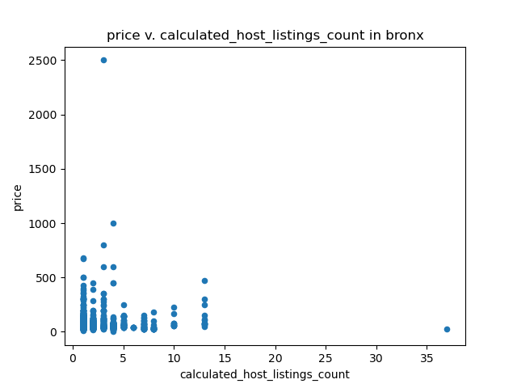

<h1 style="font-family: Georgia"> Welcome to The Bronx! </h1>
#### _by Jessica Sparacio, Sowjanya Sritharasarma, Shayaan Mohammed, and Jason Wu_

> Though it may be the second-to-the-smallest borough of NYC's five, the Bronx is still home to some of NYC's most diverse communities and attractions. 


## **_Our Project_**

The aim of our project was to explore Airbnb data in the Bronx to better understand the nature of short-term rentals in NYC. We planned to compare the Airbnb statistics in our Borough with the statistics in all Airbnb's across NYC, as well as explore four specific Bronx neighborhoods. 

We prepared three separate data-frames that we were going to compare throughout our project. Our first dataframe `airbnb` is the original dataset of all airbnb data for all four boroughs. Using `groupby`, we created two more sets, `bronx`, which contained the data just for all the neighborhoods in the Bronx, and `my_bronx`, which contained all of the data for our four specific neighborhoods. 

### Price Matters!

We decided as a group that the information about price was the most relevant when discussing airbnbs, so we wanted to approach our data analysis from this angle. When considering our neighborhoods and our borough, we wanted to primarily concentrate on correlations between price and other factors.

### Some statistics... 

To first approach our data, we wanted to get an idea of some of the basic price statistics in our three data sets. We printed out the following:

```
Number of listings in all boroughs: 48895
Number of listings in Bronx: 1091
Number of listings in our Bronx neighborhoods: 225

Price stats in all boroughs:
Mean: 152.7206871868289
Max: 10000
Min: 0

Price stats in all Bronx neighborhoods:
Mean: 87.4967919340055
Max: 2500
Min: 0

Price stats in our Bronx neighborhoods:
Mean: 79.19111111111111
Max: 450
Min: 21
```
### Visuals, Visuals, Visuals

Now that we had the preliminary price information, we wanted to visualize this data we had collected. We decided that it might be interesting to graph the mean price for each borough in NYC, each neighborhood in the Bronx, and finally each of our four neighborhoods.

**_1. Visualizing Mean Price_**

We first made bar graphs comparing the mean price of Airbnb's across New York City's five boroughs, in all the bronx neighborhoods, and in our four specific neighborhoods for our project. This data shows us that our four neighborhoods are quite similar in terms of mean price, but in comparison to the rest of the Bronx neighborhoods, our average prices fall on the shorter side.

{:height="45%" width="45%"} 
{:height="45%" width="45%"} 
{:height="45%" width="45%"} 

**_2. Price Distribution Exploration_**

We then decided comparing mean prices was too simplistic. So, we used box plots in order to compare the prices in terms of medians and quartiles between Airbnb's in all New York City negihborhoods, all Bronx neighborhoods, and our four neighborhoods.

{:height="60%" width="60%"} 

**_3. Correlational Exploration_**

> After finding that there were some obvious distributional trends, we wanted to go a step
further and see if any other factors had astrong correlation with the price ofan Airbnb. We knew that
prices in the Bronx were generally lower, but _**why?**_

<span style="color=#0366d6;">Number of Host's Other listings _vs._ Price</span>
  
We also graphed scatter plots to show the distribution of the data, as well as the minimum, maximum, and median values. This information is more useful because the median value is calculated in spite of the outlier prices.

These scatter plots show price distribution versus the host listings count for the Bronx as a whole, and for our four neighborhoods. The trend for both distributions seems to indicate that the fewer the  listings a host has, the more expensive the airbnb will be.
  
  {:height="45%" width="45%"}
  {:height="45%" width="45%"}
    
<span style="color=#0366d6;">Minimum Nights _vs._ Price</span>
  
Our other two scatter plots shows the distribution between price and minimum nights offered, for the Bronx neighborhoods and our four neighborhoods. Our data showed that most of the airbnb locations in both our four neighborhoods and in the Bronx in general tend to stay within $200 dollars in price and about a week for minimum nights.
  
  {:height="45%" width="45%"}
  {:height="45%" width="45%"}
  
<span style="color=#0366d6;">Room Type _vs._ Price</span>
  
Finally, we also decided to make pie charts to compare the number of room types available in all Bronx neighborhoods and our individual neighborhoods.

  {:height="45%" width="45%"}
  {:height="45%" width="45%"}


## **_The Breakdown_**

The Bronx is an incredible borough on it's own, but a borough is really only as much as the sum of its parts! Each member of our team explored the statistics of Airbnb in four individual Bronx neighborhoods: **Kingsbridge, Fordham, Allerton, and Concourse.** Please click through to deep dive into each team member's project!


### FORDHAM 
<span style="color=#0366d6; font-style: italic;">by: Jessica Sparacio</span> 


[Click here to learn more about Fordham!](https://jessicalrsparacio.github.io/fordhamproj)

### KINGSBRIDGE
<span style="color=#0366d6; font-style: italic;">by: Sowjanya Sritharasarma</span>


[Click here to learn more about Kingsbridge!](https://sowjan95.github.io/kingsbridge/)

### CONCOURSE
<span style="color=#0366d6; font-style: italic;">by: Shayaan Mohammed</span>


[Click here to learn more about Concourse!](https://shayaan1234.github.io/Concourse/)

### ALLERTON
<span style="color=#0366d6; font-style: italic;">by: Jason Wu</span>


[Click here to learn more about Allerton!](https://jasonwu00.github.io/HC10-Allerton/)


#### _Thanks for checking out the Bronx! Come back soon!_

